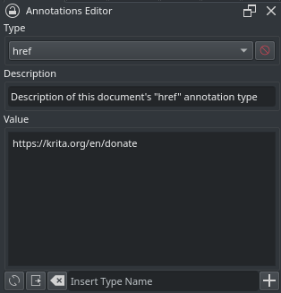

# Krita Annotations Editor

Krita documents can store a list of data records called annotations. Annotations have a description and their value is retrieved by their type name. 

This repository is a Python plugin for Krita, which adds a docker widget that you can use to edit a Krita document's annotations as plain textual data.

## System Requirements

 - Krita 5.3 ✅
 - Krita 6.0 ✅
 - Krita Android ❌

## Installation

 1. In Krita, navigate to `Tools` → `Scripts` → `Install Python Plugin from Web`
 2. Copy this URL `https://github.com/NMaghfurUsman/krita-annotations-editor` into the dialog box and press OK
 3. Restart Krita
 4. In Krita, navigate to `Settings` → `Dockers` → `Annotations Editor`

## Usage

Input your annotation's value, a description, and their type name, then click the `+` icon to add your annotation type to the document.

You can add more annotations and use the drop-down menu to view a particular one by its type name.

Edit a annotation type's value or description then click the save icon to write your changes.

## Credit

 - [KnowZero's Python Plugin Developer Tools](https://github.com/KnowZero/Krita-PythonPluginDeveloperTools) was extremely handy and very cool.
 - Krita maintainers, because this app brings me joy. [Donate](https://krita.org/en/donations/) to fund development.

## Further Work

 - i18n(?)
